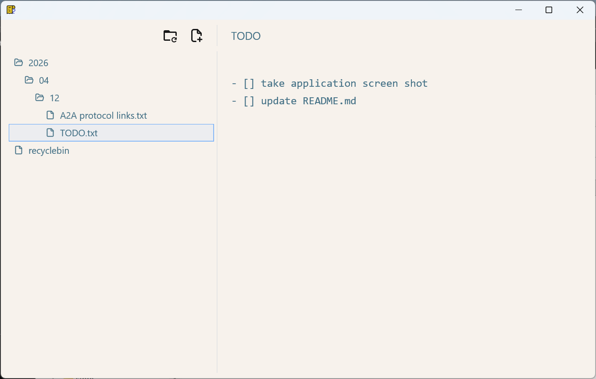

# papyru2 
A simple desktop note taking application built with Rust, `gpui`, and `gpui-component`.

<div align="center">

</div>

> [!NOTE]
> the code in this repository is authored with the help of AI coding agents and reviewed through the project's phased planning and verification process.


## Portable version prebuilt binaries

It is highly recommended to use portable version prebuilt binaries.
Download your convinient `.zip` package from [Latest release](https://github.com/ddbaker/papyru2/releases/latest).

The portable version zip package includes (Windows example):

```directory
papyru2
   │  papyru2.portable
   │
   ├─bin
   │      papyru2.exe
   │      papyru2_pin_file.exe
   │
   └─conf
          papyru2_conf.toml
```

- `papyru2.portable`: Empty marker file, do not remove
- `papyru2.exe`: Application binary
- `papyru2_pin_file.exe`: standalone helper application
- `papyru2_conf.toml`: config file

> [!IMPORTANT]
> Keep this "portable" folder structure

## Build from source code

### Example: Windows

```bash
cargo release-win
```

See [doc/release_packaging_with_icons.md](doc/release_packaging_with_icons.md) for Linux/MacOS build.

GitHub portable releases are built by [.github/workflows/release-portable.yml](.github/workflows/release-portable.yml) and upload Windows/Linux/macOS zip assets to the matching GitHub Release for an existing `v*` tag.

> [!NOTE]
> Windows icon embedding is wired in `build.rs` and uses `assets/icons/windows/papyru2_app_icon.ico`.

### Run

```bash
cargo run --bin papyru2
```
