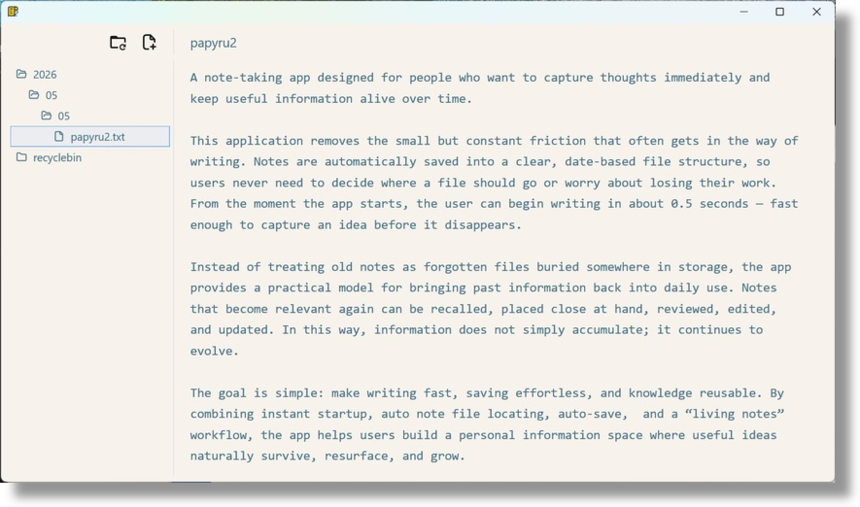

# papyru2 
A simple desktop note taking application built with Rust and `gpui-kit` 0.6, which bundles GPUI, GPUI Component, and icon assets.

<div align="center">

</div>

> [!NOTE]
> the code in this repository is authored with the help of AI coding agents and reviewed through the project's phased planning and verification process.

## Portable version prebuilt binaries

It is highly recommended to use portable version prebuilt binaries.
Download your convinient `.zip` package from [Latest release](https://github.com/ddbaker/papyru2/releases/latest).

The portable version zip package includes (Windows example):

```directory
papyru2
   │ papyru2.portable
   │
   ├─bin
   │      harper-ls.exe
   │      papyru2.exe
   │      papyru2_pin_file.exe
   │      papyru2_textfile_import.exe
   │
   ├─conf
   │      papyru2_conf.toml
   │
   └─licenses
      │   LICENSE
      │   THIRD_PARTY_NOTICES.md
      │
      └─harper
              LICENSE-Apache-2.0.txt
```

- `harper-ls.exe`: [The Free Grammar Checker That Respects Your Privacy](https://writewithharper.com/) (Apache-2.0 Licensed)
- `papyru2.portable`: Empty marker file, do not remove
- `papyru2.exe`: Application binary
- `papyru2_pin_file.exe`: standalone helper CLI for 3rd party text search program integration ([manual](./docs/papyru2_pin_file.md))
- `papyru2_textfile_import.exe`: standalone helper CLI for existing text file import ([manual](./docs/papyru2_textfile_import.md))
- `papyru2_conf.toml`: config file
- `licenses/LICENSE`: papyru2 GPL-3.0 license text
- `licenses/THIRD_PARTY_NOTICES.md`: third-party redistribution notices
- `licenses/harper/LICENSE-Apache-2.0.txt`: Harper Apache-2.0 license text

> [!IMPORTANT]
> Keep this "portable" folder structure

> [!NOTE]
> GitHub portable releases are built by [.github/workflows/release-portable.yml](.github/workflows/release-portable.yml) and upload Windows/Linux/macOS zip assets to the matching GitHub Release for an existing `v*` tag.

## Build from source code

### Example: Windows

```bash
cargo release-win
```

See [docs/release_packaging_with_icons.md](docs/release_packaging_with_icons.md) for Linux/MacOS build.

> [!NOTE]
> Windows icon embedding is wired in `build.rs` and uses `assets/icons/windows/papyru2_app_icon.ico`.

### Run

```bash
cargo run --bin papyru2
```

## Integrating External Text Search Tools

> [!IMPORTANT]
> `papyru2` does not provide a built-in full-text search interface. To search
> notes, use an external text search tool and configure that tool to run the
> `papyru2_pin_file` helper command for the selected result.

`papyru2_pin_file` opens the selected note in `papyru2` and moves it into
today's note folder.

Refer two documents below:

Ref-1: [Integration Overview](./docs/text_search_tool_integration.md)

Ref-2: ["Television" search tool integration hands-on](./docs/text_search_tv_integration.md)
